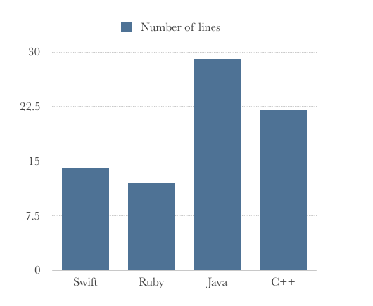
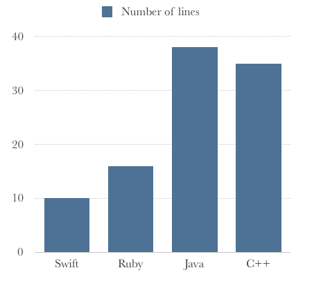
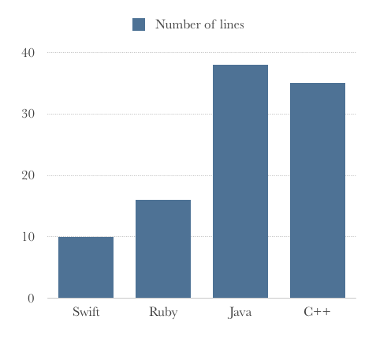
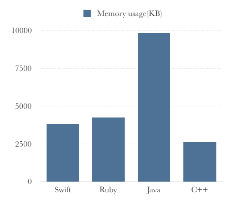

# Benchmark In Multiple Languages


## Languages

* ### JAVA
* ### C++
* ### Swift
* ### Ruby

## Testing Environment

### Desktop
  * **CPU** : Intel Core i5-2500 3.30GHz
  * **Memory** : 32GB 1867 MHz DDR3
  * **OS** : macOS Sierra 10.12.4

### Languages
* **Ruby** : 2.4.0
* **Swift** : 3.1
* **JAVA** : JRE6
* **C++** : c++14(g++4.2.1)

### IDE
* **Ruby** : RubyMine 2017.2
* **Swift** : Xcode 8.3.3
* **JAVA** : Eclipse neon.3
* **C++** : Visual Studio 2015


## Functions

* ### LoopCount
  * Example (C++)
  ```c
  #include<stdio.h>
  #include<Windows.h>
  void main(){
  	Sleep(1000);

  	DWORD dwTime;
  	DWORD dwLast;
  	DWORD i=0;
  	dwTime=GetTickCount();
  	while(true){
  		i++;
  		dwLast=GetTickCount();
  		if(dwLast-dwTime>=1000){
  			break;
  		}
  	}
  	printf("시작 시간(ms) : %dms\n",dwTime);
  	printf("종료 시간(ms) : %dms\n",dwLast);
  	printf("걸린 시간(ms) : %dms\n",dwLast - dwTime);
  	printf("카운트 횟수 : %d번\n",i);
  	printf("1000ms당 카운트 횟수 : %f번\n",((double)i / (dwLast - dwTime) * 1000));
  	getchar();
  }
  ```
  * Code Size



  * Memory Usage


* ### IntegerProc
  * Example (C++)
  ```c
  #include "stdafx.h"
  #include<stdlib.h>
  #include<time.h>
  #include<windows.h>

  int _tmain(int argc, _TCHAR* argv[])
  {
  	Sleep(1000);

  	srand((unsigned int)time(NULL));

      DWORD dwTime;
      DWORD dwLast;
      int i;
      long iNum1,iNum2,iNum3,iNum4;
      long iResult;

      dwTime = GetTickCount();
      for(i=0;i<100000000;i++){
          iNum1 = rand()%10000;
          iNum2 = rand()%10000;
          iNum3 = rand()%10000;
          do{
              iNum4 = rand()%10000;
          }while(iNum4==0);

          iResult = ((iNum1 + iNum2) * iNum3) / iNum4;
      }
      dwLast = GetTickCount();
  	printf("시작 시간(ms) : %d\n",dwTime);
  	printf("종료 시간(ms) : %d\n",dwLast);
  	printf("걸린 시간(ms) : %d\n",dwLast - dwTime);
  	getchar();

  	return 0;
  }
  ```
  * Code Size



  * Memory Usage


  * Execution Time


* ### FloatingProc
  * Example (C++)
  ```c
  #include "stdafx.h"
  #include<stdlib.h>
  #include<time.h>
  #include<windows.h>

  int _tmain(int argc, _TCHAR* argv[])
  {
  	Sleep(1000);

  	srand((unsigned int)time(NULL));

      DWORD dwTime;
      DWORD dwLast;
      int i;
      double iNum1,iNum2,iNum3,iNum4;
      double iResult;

      dwTime = GetTickCount();
      for(i=0;i<100000000;i++){
          iNum1 = rand()/1000.0;
          iNum2 = rand()/1000.0;
          iNum3 = rand()/1000.0;
          do{
              iNum4 = rand()/1000.0;
          }while(iNum4==0);

          iResult = ((iNum1 + iNum2) * iNum3) / iNum4;
      }
      dwLast = GetTickCount();
  	printf("시작 시간(ms) : %d\n",dwTime);
  	printf("종료 시간(ms) : %d\n",dwLast);
  	printf("걸린 시간 : %d\n",dwLast - dwTime);
  	getchar();

  	return 0;
  }
  ```
  * Code Size



  * Memory Usage



  * Execution Time


